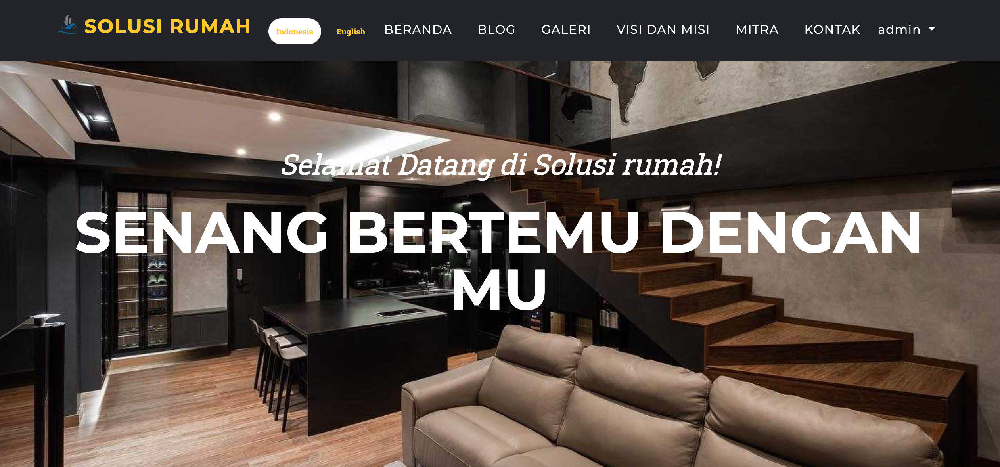

# Company Profile "Rumah Solusi"

Company Profile Admin CMS

fiture :

Front-end (Landing Page)

1. Custom One page scroll Landing Page (fully responsive in all devices)
2. Dual Language (English / Indonesia)
3. Image Slider
4. Welcome Text Introduction
5. Photo Gallery
6. YouTube video embed Gallery
7. Vision Mission
8. Blog / News Update
9. Partner Logo
10. Contact Form
11. Social Media Information

Back-end (Administrator CMS Page)

1. Manage / Upload Image Slider
2. Manage Photo Gallery photo
3. Manage YouTube Video
4. Manage Static text (Welcome text intro, Vision Mission, etc)
5. Manage Blog / News
6. Manage Partner Logo
7. Manage Contact Data (form contact form)
8. Manage Organization Profile Setting (Social Media, Phone, Address, email)

## Run Locally

Clone the project

```bash
  git clone https://github.com/Tsahrian/CompanyProfile
```

Go to the project directory

```bash
  cd my-project
```

Start the server

```bash
  php artisan serve
```

## Demo

http://127.0.0.1:8000/

## Screenshots

### Home



### Admin Dashboard


